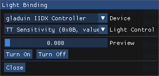

# hey yo
 - this branch uses [this](https://github.com/John-Lluch/Encoder) library (timer-based interrupt, instead of pin change interrupt) for encoder
	- in other words, there is no need to put your encoder onto interrupt capable pins
 - not tested, use with caution

# iidx-controller
Software that enables you to create your own Arduino based beatmania IIDX controller.

# Features
 - HID lighting support (that works with btools and ttools).
 - Customisable sensitivity over HID for use with lightning mode or your own custom program (more on this further down).
 - Different lighting modes (more info on this further down in the `Setup` section).

# Requirements
 - An Arduino Leonardo (technically compatible with any ATmega32U4 based board, but only tested with a Leonardo).
 - The [Bounce2](https://www.arduino.cc/reference/en/libraries/bounce2/) library.

# Setup
Buttons:
 - One terminal to GND and the other terminal to the corresponding pin.

LEDs:
 - Positive terminal to corresponding pin.
 - Negative terminal to GND.

Encoder:
 - ~~The encoder's phase wires are ***REQUIRED*** to be connected to interrupt pins so it is advised to leave the encoder pins alone when editing the pinout.~~
 - Set the PPR in `iidx-controller/IIDXHID.h`, line `5`.
 
Sensitivity:
 - If you want the default sensitivity to be something else than the current, change the ~~second value of the array on line `56` of `iidx-controller/iidx-controller.ino`~~.
	- moved to config.h
 - ~~You can change the 10 sensitivity values by changing the values in the array on line `56` of `iidx-controller/iidx-controller.ino`.~~
	- there is no sensitivity_lookup anymore, higher the number, the more insensitive it is
 - ~~Sensitivity can be disabled by setting `NO_SENSITIVITY` to `1` in `iidx-controller/IIDXHID.h` on line `7`.~~
	- i dunno if it still works

LED mode switching:
 - Hold the last button in the button array, and then tap the first button in the button array to switch modes.
 - The LED mode rotation is as follows:
   1. HID / reactive auto (default setting, this switches to reactive mode if there are no LED HID messages in 3 seconds)
   2. Reactive only
   3. HID only
   4. HID _and_ reactive

Info:
 - Pinouts are available in ~~`iidx-controller/iidx-controller.ino`~~, you can edit them there if necessary.
	- moved to config.h
 - If changing the number of buttons / LEDs, change the value in `iidx-controller/IIDXHID.h` (line `3` and `4` respectively) to the new number of buttons / LEDs.
 - Leonardo pinout (what the numbers in the code's pinout arrays mean) at the bottom of this page.

# HID Sensitivity
In spice, select `Beatmania IIDX` and go to the `Lights` tab. Scroll down until you see `Turntable P1 Resistance` and click the `Bind` button.  
For `Device` select your Arduino, and for `Light Control` select `TT Sensitivity`.

You'll then be able to set the turntable sensitivity via the resistance menu on the subscreen in iidx >27 (with lightning mode enabled).

_NOTE: I haven't actually been able to test this, since I have a 60hz screen and can't boot into lightning mode. Please report any issues you encounter in the issues section._

# Thanks
Huge thanks to [CrazyRedMachine](https://github.com/CrazyRedMachine) for helping me out when I got stuck, and for their [SoundVoltexIO](https://github.com/CrazyRedMachine/SoundVoltexIO) repository.

# Leonardo pinout
 

